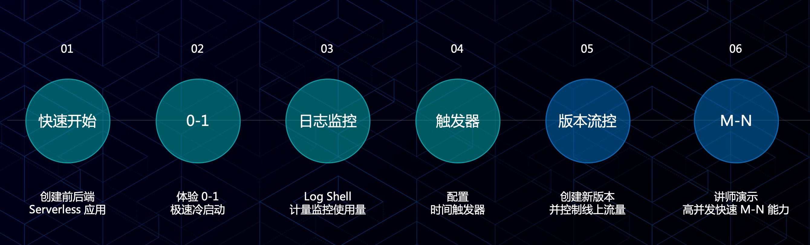

# 基于 Serverless 轻松构建云上应用

作为云原生技术前进方向之一，Serverless 架构让您进一步提高资源利用率，更专注于业务研发。通过我们的 workshop，您
可以体验到快速创建 Serveless 应用、根据业务请求秒级 0-1-N 自动伸缩、通过日志查看器快速排错等产品新功能。

## Workshop 操作内容

### 流程图

### Step 0: 前期准备

### Step 1: 快速发布后端 Java 应用

Frontend 配置

- 监听端口：8080
- 入口方法：com.demo.alipay.Main::main
- 环境变量：
  - BACKEND_URL=bookinfo-backend.sas.alipay.com
  - LOG_ROOT_PATH=/home/admin/logs (选填)

## Backend 配置

- 监听端口：8080
- 入口方法：com.demo.alipay.Main::main
- 环境变量：
  - DATABASE_URL=your-db-url
  - DATABASE_USERNAME=your-db-username
  - DATABASE_PASSWORD=your-db-password
  - LOG_ROOT_PATH=/home/admin/logs (选填)